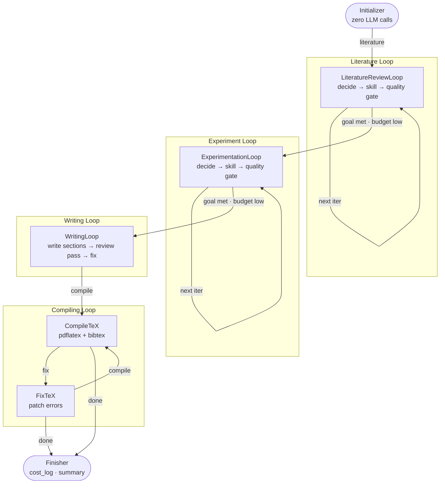

<div align="center">


# Nano-scientist

### *Nano. Lean. Four loops, one paper.*

<p>
  <a href="https://github.com/AI4Scientist/nano-scientist/stargazers"></a>
  <a href="https://github.com/AI4Scientist/nano-scientist/blob/main/LICENSE"></a>
  <a href="https://github.com/AI4Scientist/nano-scientist/issues"></a>
</p>

<p>
  
  
  
  
  
</p>

**An autonomous research agent that turns a topic into a peer-reviewed technical report — within a dollar budget you set.**

Built on [PocketFlow](https://github.com/The-Pocket/PocketFlow) · Inspired by [karpathy/autoresearch](https://github.com/karpathy/autoresearch)

<hr />

</div>

## 🔥 News

- **[2026. 05]** 🎉 **Major Release!** 87 modular skills, CrossRef citation recovery, multi-model quality gate via `REVIEWER_MODEL`, and MCP server injection. Full BibTeX stub fallback ensures zero undefined citations.
- **[2026. 01]** 🚀 Nano-scientist public launch — budget-first autonomous research pipeline producing LaTeX + BibTeX + PDF in a single `python main.py` call.

---

## ✨ Why Nano-scientist

| | |
|---|---|
| **Budget-first control** | Fix a dollar limit; the agent adapts depth and report type automatically. Loops exit the moment estimated remaining calls fall too low — no wasted spend. |
| **Four autonomous loops** | Literature → Experimentation → Writing → Compiling — each self-terminating on quality gate or budget exhaustion. No central planner. |
| **87 modular skills** | From paper search and code generation to grant proposals, patent drafting, and adversarial review. Lazy-loaded; each skill is one `SKILL.md` file. |
| **Research-to-PDF pipeline** | Produces LaTeX source, deduplicated BibTeX (CrossRef-verified), per-skill artifact files, figures, scripts, and a compiled PDF — all in one run. |
| **Zero-drop citations** | Entries failing CrossRef verification are recovered via title lookup or kept as `@misc` stubs — never silently dropped. |

---

## 🧪 Showcases

Sample reports generated by Nano-scientist at `--budget 1`:

- [What techniques bridge the performance gap between small language models and LLMs in automated bug fixing?](showcases/slm/report.pdf)
- [Challenge taxonomy for the Lean 4 theorem prover: clustering, labeling, and trend analysis across GitHub issues.](showcases/lean4/report.pdf)
- [Comparative analysis of five AI coding agents across 933k pull requests (AIDev).](showcases/aidev/report.pdf)
- [Survey of on-policy distillation techniques.](showcases/opd/report.pdf)

---

## 🧠 How it works



### Stage breakdown

| Stage | What happens |
|---|---|
| **Initializer** | Creates `outputs/<uuid>/`, classifies topic as survey vs. experimental (`is_survey`) — zero LLM calls |
| **LiteratureReviewLoop** | Each iter: LLM picks `skill\|done` → executes skill → quality gate checks goal; exits on goal met or budget low |
| **ExperimentationLoop** | Survey: synthesis skills (tables, figures from literature). Experimental: `experiment-pipeline`, `experiment-craft`, etc. |
| **WritingLoop** | Writes all required sections, runs a peer-review pass, addresses major comments, assembles `.tex` |
| **CompilingLoop** | `pdflatex` + `bibtex`; on error or undefined citations, FixTeX patches and recompiles (up to 2 attempts) |
| **Finisher** | Writes `cost_log.json` + `summary.json`, prints total cost |

---

## 🚀 Quickstart

```bash
# 1) Clone
git clone https://github.com/AI4Scientist/nano-scientist
cd nano-scientist

# 2) Install dependencies
pip install -r requirements.txt

# 3) Add API keys
cp .env.example .env
# edit .env — minimum: OPENROUTER_API_KEY

# 4) Run
python main.py "CRISPR off-target effects in primary T cells" --budget 2.00

# Or pass a research proposal .md file
python main.py proposal.md --budget 0.50
```

Output lands in `outputs/<uuid>/`:

```text
outputs/
└── <uuid>/
    ├── report.tex         # assembled LaTeX source
    ├── report.pdf         # final PDF (if pdflatex installed)
    ├── references.bib     # deduplicated BibTeX
    ├── artifacts/         # per-skill markdown outputs
    ├── figures/           # generated plots / images
    ├── data/              # collected CSV / JSON data
    ├── scripts/           # executed code blocks
    ├── traj.txt           # full stdout trace
    ├── history.json       # step-by-step execution log
    ├── cost_log.json      # per-step token costs
    └── summary.json       # final run summary
```

---

## 🖥️ CLI reference

```text
python main.py [topic] [options]

Arguments:
  topic                 Research topic — a plain string or path to a .md file.
                        Optional when using --list-skills.

Options:
  -b, --budget FLOAT    Spend limit in USD  (default: $1.00)
  -o, --output DIR      Output directory    (default: outputs/)
  -e, --env FILE        Path to .env file   (default: .env)
  --list-skills         Print available skills and exit
```

```bash
python main.py "CRISPR off-target effects in primary T cells" --budget 1.00
python main.py proposal.md --budget 1.00
python main.py --list-skills
```

### Budget

Every run targets a full 8-section paper. Budget controls **depth**, not report type — more budget means more skill calls, more citations, and more revision rounds. Loops terminate when estimated remaining LLM calls drop below a threshold, so the agent always spends as much as it can usefully spend.

---

## 🧩 Skills

Each skill is a folder under `skills/` with a single `SKILL.md` (lazy-loaded at runtime). Skills with `allowed-tools: Bash` get a real tool-calling loop with bash execution and error feedback.

<details>
<summary><b>Core research skills (click to expand)</b></summary>

| Skill | What it does |
|---|---|
| `paper-navigator` | Find and read academic papers: keyword search, citation traversal, arXiv monitoring, SOTA lookup |
| `research-survey` | Structured literature survey: outline → draft → section expansion → final assembly with dense citations |
| `research-ideation` | Multi-persona ideation → ELO tournament ranking → manuscript-quality proposal |
| `paper-planning` | Story design, experiment planning, figure design, 4-week timeline |
| `experiment-pipeline` | 4-stage experiment execution: baseline → hyperparameter tuning → proposed method → ablation |
| `experiment-craft` | Debug and iterate on existing experiments: 5-step diagnostic flow |
| `experiment-iterative-coder` | Iterative code refinement: plan → code → evaluate → refine cycles with lint/test scoring |
| `paper-writing` | Academic sections: 11-step workflow with LaTeX templates and section-by-section guidance |
| `paper-review` | Pre-submission self-review: 5-aspect checklist, adversarial stress-testing |
| `paper-rebuttal` | Peer-review rebuttals: score diagnosis, comment prioritization, 18 tactical writing rules |
| `evo-memory` | Persistent research memory: Ideation Memory + Experimentation Memory across cycles |
| `study-workflow` | Publication-quality research workflow diagram as PNG via image generation |

</details>

<details>
<summary><b>Extended skill library — 87 skills total</b></summary>

| Skill | What it does |
|---|---|
| `ablation-planner` | Design ablations from a reviewer's perspective for paper submission |
| `alphaxiv` | Quick single-paper lookup via AlphaXiv LLM-optimized summaries |
| `analyze-results` | Compute statistics, generate comparison tables from ML experiment results |
| `arxiv` | Search, download, and summarize papers from arXiv |
| `auto-paper-improvement-loop` | Autonomously improve a generated paper via GPT review → fix → recompile |
| `auto-review-loop` | Autonomous multi-round research review loop via Codex MCP |
| `auto-review-loop-llm` | Same review loop using any OpenAI-compatible LLM API |
| `auto-review-loop-minimax` | Same review loop using MiniMax API |
| `citation-audit` | Verify every bibliographic entry is real, correctly attributed, and in context |
| `claims-drafting` | Draft patent claims for an invention |
| `comm-lit-review` | Communications-domain literature review (wireless, networking, satellite, cellular) |
| `deepxiv` | Search and progressively read open-access papers through DeepXiv |
| `dse-loop` | Autonomous design space exploration for computer architecture and EDA |
| `embodiment-description` | Write detailed embodiment descriptions for patent specifications |
| `exa-search` | AI-powered web search via Exa with content extraction |
| `experiment-audit` | Audit experiment integrity via cross-model review before claiming results |
| `experiment-bridge` | Bridge from EXPERIMENT_PLAN.md to GPU-deployed initial results |
| `experiment-plan` | Turn a proposal into a claim-driven experiment roadmap |
| `experiment-queue` | SSH job queue for multi-seed/multi-config ML experiments with OOM-aware retry |
| `feishu-notify` | Send notifications to Feishu/Lark |
| `figure-description` | Process patent figures and generate formal drawing descriptions |
| `figure-spec` | Deterministic publication-quality diagrams from JSON to editable SVG |
| `formula-derivation` | Structure and derive research formulas into paper-ready derivation packages |
| `gemini-search` | Broad literature discovery via Gemini |
| `grant-proposal` | Draft structured grant proposals (KAKENHI, NSF, NSFC, ERC, DFG, SNSF, ARC, NWO) |
| `idea-creator` | Generate and rank research ideas given a broad direction |
| `idea-discovery` | Full pipeline: lit review → idea generation → novelty check → critical review |
| `idea-discovery-robot` | Same pipeline adapted for robotics and embodied AI |
| `invention-structuring` | Structure a raw invention into a formal invention disclosure |
| `jurisdiction-format` | Compile patent into CN/US/EP jurisdiction-specific filing format |
| `kill-argument` | Adversarial two-thread review: strongest rejection memo → point-by-point defense |
| `mermaid-diagram` | Generate Mermaid diagrams (.mmd + .md) with syntax verification |
| `meta-optimize` | Analyze ARIS usage logs and propose harness optimizations |
| `monitor-experiment` | Monitor running experiments, check progress, collect results |
| `novelty-check` | Verify research idea novelty against recent literature |
| `openalex` | Search via OpenAlex for open citation data and institutional metadata |
| `overleaf-sync` | Two-way sync between local paper directory and Overleaf via Git bridge |
| `paper-claim-audit` | Verify every number and comparison in the paper matches raw result files |
| `paper-compile` | Compile LaTeX to PDF, fix errors, verify output |
| `paper-figure` | Generate publication-quality figures and tables from experiment results |
| `paper-illustration` | AI illustrations for academic papers via Gemini image generation |
| `paper-illustration-image2` | Same via Codex native image generation |
| `paper-plan` | Generate structured outline from review conclusions and experiment results |
| `paper-poster` | Conference poster (A0/A1 PDF + editable PPTX + SVG) from a compiled paper |
| `paper-slides` | Conference slides (Beamer PDF + editable PPTX) with speaker notes |
| `paper-talk` | End-to-end conference talk pipeline: paper → outline → Beamer + PPTX → export |
| `paper-write` | Draft LaTeX section by section from an outline |
| `patent-novelty-check` | Assess patent novelty and non-obviousness against prior art |
| `patent-pipeline` | Full patent drafting: CN/US/EP support, invention patents and utility models |
| `patent-review` | External patent examiner review of a patent application |
| `pixel-art` | Generate pixel art SVG illustrations for READMEs and docs |
| `prior-art-search` | Search patent databases and academic literature for prior art |
| `proof-checker` | Rigorous mathematical proof verification and fixing workflow |
| `proof-writer` | Write rigorous mathematical proofs for ML/AI theory |
| `qzcli` | Manage GPU compute jobs on the Qizhi (启智) platform |
| `rebuttal` | Submission rebuttal pipeline with coverage enforcement and venue limits |
| `research-ideation` | Multi-persona ideation → ELO ranking → manuscript-quality proposal |
| `research-lit` | Search and analyze papers, find related work, summarize key ideas |
| `research-pipeline` | Full pipeline: idea discovery → implementation → review → paper writing |
| `research-refine` | Turn a vague direction into a problem-anchored, frontier-aware method plan |
| `research-refine-pipeline` | Chain research-refine + experiment-plan in one shot |
| `research-review` | Deep critical review of research via Codex MCP |
| `research-wiki` | Persistent research knowledge base across the full research lifecycle |
| `resubmit-pipeline` | Orchestrate text-only paper resubmission to a different venue |
| `result-to-claim` | Judge what claims experiment results support before writing |
| `run-experiment` | Deploy and run ML experiments on local, remote, Vast.ai, or Modal GPU |
| `semantic-scholar` | Search published papers via Semantic Scholar API with citation metadata |
| `serverless-modal` | Run GPU workloads on Modal — training, fine-tuning, inference |
| `slides-polish` | Per-page Codex review + targeted python-pptx / Beamer fixes |
| `specification-writing` | Write full patent specification from claims and invention disclosure |
| `system-profile` | Profile scripts, processes, GPU, memory, interconnect — structured reports |
| `training-check` | Periodic WandB metric checks to catch NaN/divergence/idle GPUs early |
| `vast-gpu` | Rent, manage, and destroy GPU instances on vast.ai |
| `writing-systems-papers` | Paragraph-level blueprint for 10–12 page systems papers (OSDI, SOSP, ASPLOS) |

</details>

### Add a skill

1. Create `skills/my-skill/SKILL.md` with YAML frontmatter:

```markdown
---
id: my-skill
description: One-line description shown in the planner.
allowed-tools: Bash        # grants bash tool-calling with error feedback
required-keys: [HF_TOKEN]  # optional; skill is filtered out if key missing
---

Your skill instructions here.
```

2. Register in `skills/skills.json`:

```json
{ "id": "my-skill", "description": "One-line description shown in the planner." }
```

---

## 🔐 Environment variables

### Required

| Variable | Used for |
|---|---|
| `OPENROUTER_API_KEY` | Core LLM inference (all nodes) |

### Skill-gated (optional)

| Variable | Skills that use it |
|---|---|
| `HF_TOKEN` | Skills accessing Hugging Face Hub |
| `GITHUB_TOKEN` | Skills querying GitHub repos/issues |
| `S2_API_KEY` | Semantic Scholar API |
| `OPENAI_API_KEY` | Skills using OpenAI-compatible endpoints |

Missing skill keys automatically filter out dependent skills at startup.

### Tuning (all optional)

| Variable | Default | Purpose |
|---|---|---|
| `MODEL_NAME` | — | Override the inference model |
| `INFERENCE_BASE_URL` | — | Custom OpenAI-compatible endpoint |
| `REVIEWER_MODEL` | — | Second model for quality gate (e.g. `openai/gpt-4o`); falls back to `MODEL_NAME` if unset |
| `INPUT_TOKEN_COST_PER_MILLION` | — | Estimate remaining LLM calls |
| `OUTPUT_TOKEN_COST_PER_MILLION` | — | Estimate remaining LLM calls |
| `LOOKBACK` | `3` | History steps visible per LLM call |
| `MAX_REVIEW_ROUNDS` | `1` | Writing review/revision passes |
| `MAX_TOOL_ROUNDS` | `16` | Max bash tool-calling rounds per skill |
| `MAX_LOOP_ITERATIONS` | `20` | Max iterations per research loop |
| `MIN_CALLS_TO_CONTINUE` | `3` | Stop loop when estimated remaining calls falls below this |
| `OUTPUT_LANGUAGE` | auto-detect | Force output language (e.g. `"French"`); ASCII-only topics default to English |

---

## 🗂️ Project layout

```text
nano-scientist/
├── main.py              # CLI entry point
├── src/
│   ├── flow.py          # PocketFlow wiring (3 loops + compile/fix)
│   ├── nodes.py         # 7 nodes + helpers
│   └── utils.py         # LLM client, cost tracking, BibTeX utils
├── skills/              # 87 modular research skills
│   ├── skills.json      # skill index (id + description)
│   └── <skill-name>/
│       └── SKILL.md     # instructions + YAML frontmatter
├── outputs/             # generated reports (git-ignored)
└── .env                 # API keys (git-ignored)
```

---

## 🤝 Join the Community

- [Open an issue](https://github.com/AI4Scientist/nano-scientist/issues) — bug reports, feature requests, skill ideas
- [Submit a PR](https://github.com/AI4Scientist/nano-scientist/pulls) — new skills are one `SKILL.md` file

---

## 📌 Citation

If you use Nano-scientist in your research, please cite:

```bibtex
@software{nano_scientist2026,
  title  = {Nano-scientist: Autonomous Research Agent for Budget-Constrained Scientific Reports},
  author = {{AI4Scientist Team}},
  year   = {2026},
  url    = {https://github.com/AI4Scientist/nano-scientist}
}
```
